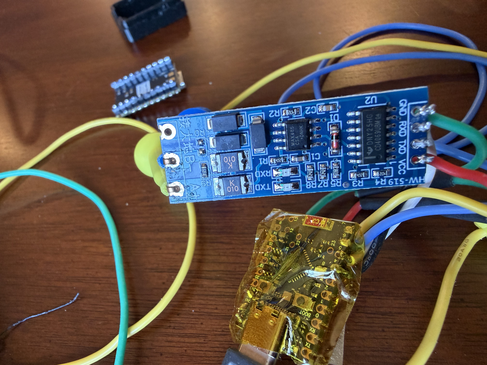

# Hardware

## Identifying your controller board

Before starting, verify your unit uses a compatible board. Open the heat pump's electrical compartment and look at the main control PCB. You're looking for:

- **PCB silkscreen marking**: **`R-SY013-BP`** (this is the searchable identifier)
- **Firmware label**: SMBPRO53 V1.44 (may vary; check service menu if accessible)
- **Two RS-485 ports**: a JST connector going to the display (COM4) and a screw terminal block (COM2)

*The CHICO R-SY013-BP control board. The PCB part number is visible near the bottom center. The green screw terminal block (COM2) is at the bottom edge.*

If your board doesn't have `R-SY013-BP` printed on it but is visually similar, it may still work — CHICO produces several closely-related boards. Read [PROTOCOL.md](PROTOCOL.md) and try one register read before connecting to write.

## Parts list

| Part | Notes | Approx. cost |
|------|-------|--------------|
| ESP32-C6 Super Mini | Any ESP32 with a free UART works; -C6 chosen for size and WiFi 6 | ~$5 |
| HW-519R4 MAX485 module | Auto flow control (no DE/RE control needed); 5V or 3.3V variants exist | ~$2 |
| Twisted pair wire | CAT5/CAT6 pair, or shielded if your install is electrically noisy | scrap |
| 5V power supply | USB or DC, anything that can power the ESP cleanly | varies |
| Enclosure | Optional, but the heat pump bay is electrically noisy — separate enclosure recommended | varies |

Total: under $20 for the electronics.

## Wiring

The Aquastrong HEX 75 controller (CHICO SMBPRO53, board `R-SY013-BP`) has multiple RS-485 ports. The two relevant ones:

*Bottom edge of the control board showing the RS-485 port labels. The green screw terminal block carries COM2 (labeled `ACOM2B` / `ACOM2A`). The JST connector nearby goes to the OEM display.*

| Port | Connector type | Original use | What we use it for |
|------|---------------|-------------|---------------------|
| COM4 | JST 4-pin | OEM touchscreen display | Leave this alone — display stays here |
| COM2 | Screw terminal block (A, B) | Auxiliary | **ESP32 connects here** |

### COM2 connections

*Two wires connected to the COM2 screw terminal block (labeled COM2 on the board).*

| CHICO COM2 terminal | MAX485 module |
|---|---|
| A | A |
| B | B |

### MAX485 to ESP32-C6

*HW-519R4 MAX485 module (blue board, center) wired to the ESP32-C6 Super Mini (top right). The colored wires at the bottom connect to the heat pump's COM2 terminal.*

| MAX485 | ESP32-C6 | Notes |
|---|---|---|
| VCC | 5V or 3.3V (match module variant) | |
| GND | GND | |
| RO (receiver out) | GPIO5 (RX) | |
| DI (driver in) | GPIO4 (TX) | |
| DE / RE | not connected | HW-519R4 has auto flow; if your module requires it, tie DE+RE together to a GPIO and configure `flow_control_pin` in ESPHome |

### Optional: termination & biasing

For short runs (<5 ft) in a quiet environment, you can skip these. For longer runs or noisy installs:

- **120Ω termination** across A-B at each end of the bus. Many MAX485 modules have this built in (often a soldered or jumpered resistor). The OEM display end is already terminated by the controller.
- **Bias resistors** (680Ω pull-up on A to VCC, 680Ω pull-down on B to GND) keep the line in a known state when idle. Often built into the MAX485 module.

## CRC errors and noise

The compressor and fan motors in the heat pump produce EMI that can corrupt RS-485 traffic on cables routed near AC wiring. Symptoms:

- Periodic `CRC Check failed` warnings in the ESP log
- Sensors sometimes go stale for a poll cycle then recover

If error rate exceeds ~5 per second during operation:

1. **Twist the A/B pair** if not already twisted. Untwisted parallel runs are antennas.
2. **Use shielded cable**. Ground the shield at the ESP end only (not both — creates ground loops).
3. **Route cable away from AC wiring**, especially the compressor and fan motor leads. Even a few inches of separation helps.
4. **Add a clip-on ferrite bead** near the heat pump end of the cable.

The ESPHome modbus_controller component retries failed reads automatically, so transparent recovery is the norm even with some CRC noise. The integration's write-confirmation logic is also fault-tolerant.

## Why not just use COM4?

Earlier attempts tried sharing COM4 with the display by intercepting the JST connection. Result: ~17 CRC errors per second, near-zero successful reads, the controller producing spurious fault codes from the bus chaos.

**Conclusion**: two-master Modbus RTU on a shared bus doesn't work reliably with this controller. Use COM2.

## Physical install notes

- The CHICO board is inside the heat pump's electrical compartment, typically behind a removable panel
- Watch for high-voltage AC inside the same enclosure
- The COM2 terminal block is usually labeled but check against your unit's wiring diagram
- The ESP can be mounted inside or outside the heat pump's enclosure. Outside is preferred (less EMI, easier service) — feed the A/B/GND wires out through a sealed gland.

## Verification before flashing

Before powering up the ESP:

1. Confirm A and B aren't swapped (RS-485 won't communicate if reversed)
2. Confirm GND is connected — RS-485 is differential but the transceivers still need a common reference
3. Confirm 5V/3.3V to the MAX485 matches your module's spec
4. Confirm the OEM display still works after you've connected the ESP to COM2 (it should — different ports)
